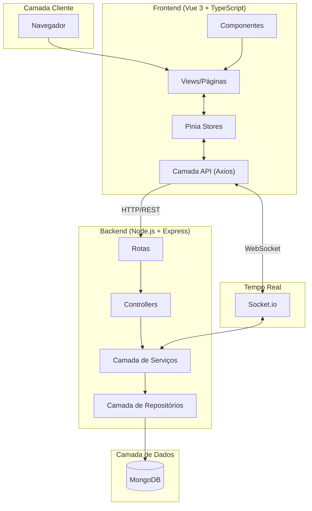
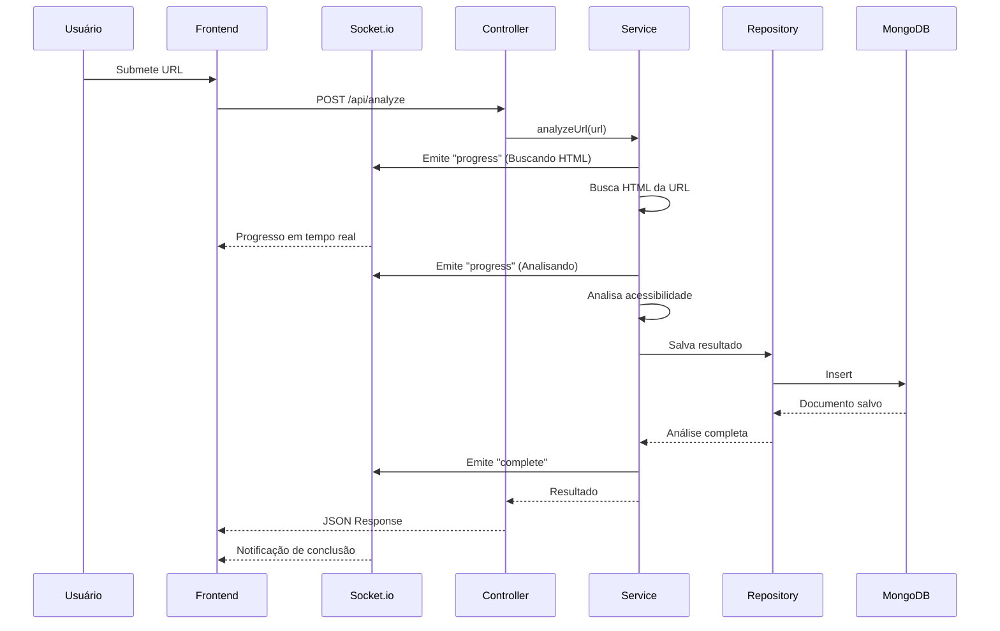
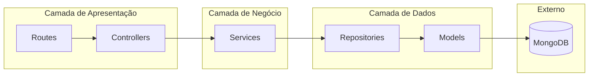
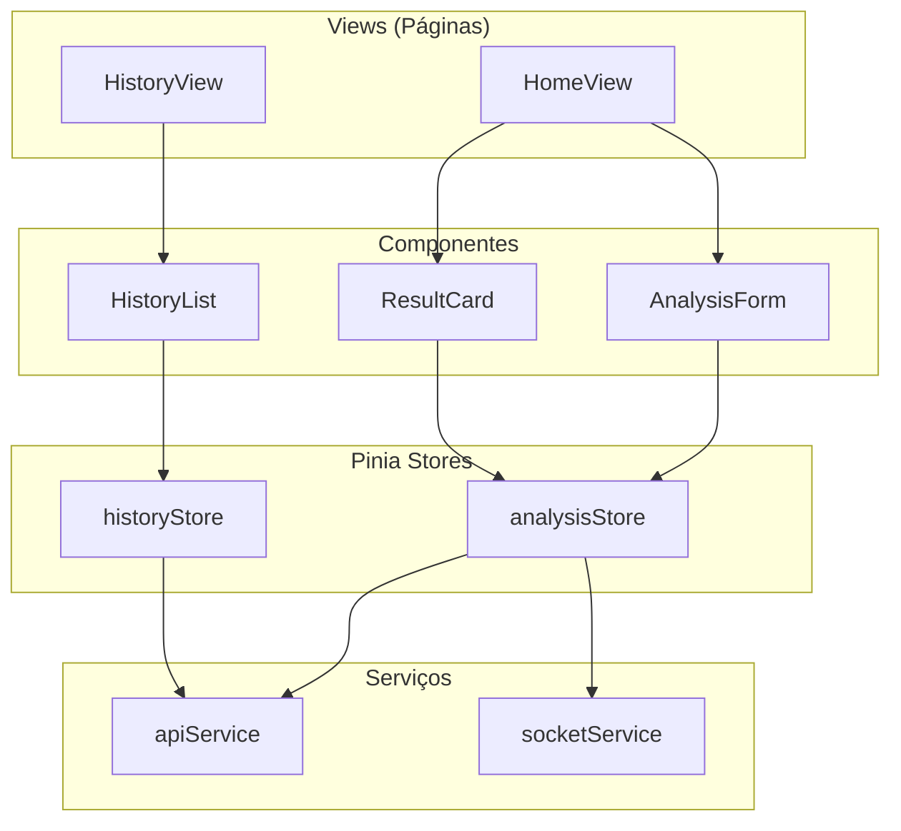
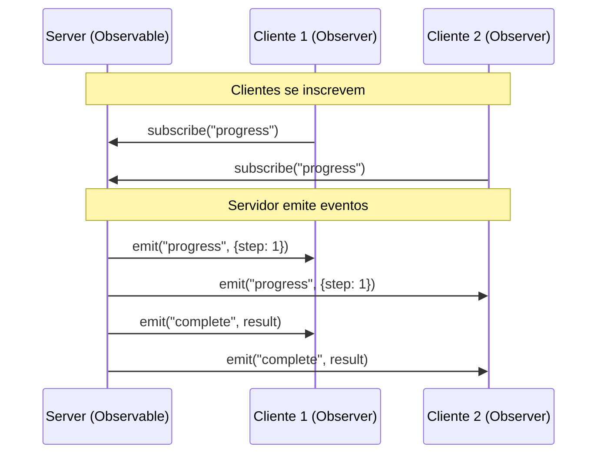
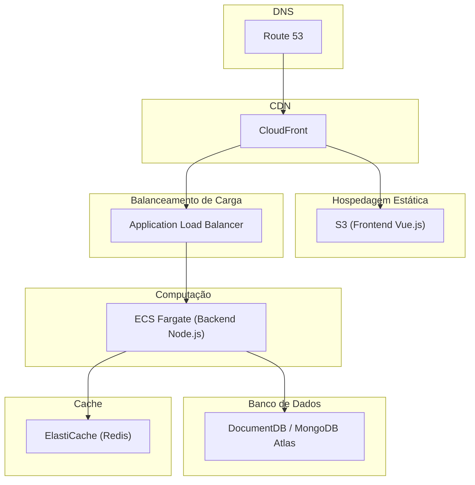
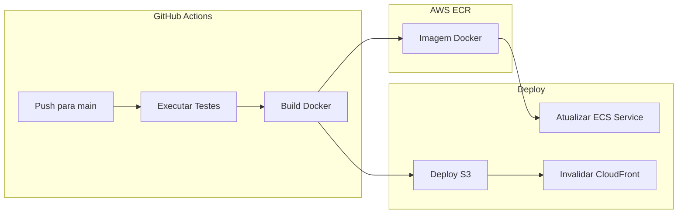
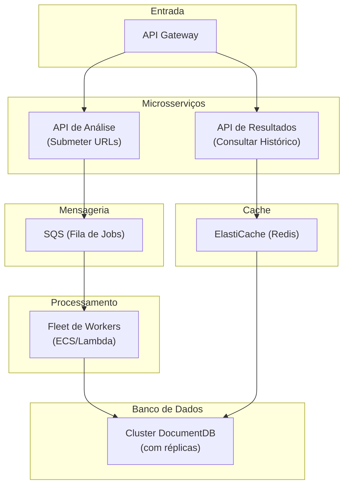

# Hand Talk - Analisador de Acessibilidade Web

Uma aplicação full-stack para análise de acessibilidade de websites, desenvolvida como parte do desafio técnico Hand Talk Full Stack Developer III.

## Sumário

- [Visão Geral](#visão-geral)
- [Arquitetura](#arquitetura)
- [Stack Tecnológica](#stack-tecnológica)
- [Estrutura do Projeto](#estrutura-do-projeto)
- [Como Executar](#como-executar)
- [Executando com Docker](#executando-com-docker)
- [Documentação da API](#documentação-da-api)
- [Decisões Arquiteturais](#decisões-arquiteturais)
- [Padrões de Projeto](#padrões-de-projeto)
- [Trade-offs e Melhorias](#trade-offs-e-melhorias)
- [Estratégia de Deploy em Produção (AWS)](#estratégia-de-deploy-em-produção-aws)
- [Desafios de Escalabilidade](#desafios-de-escalabilidade)
- [Testes](#testes)

---

## Visão Geral

Esta aplicação permite que usuários submetam uma URL para análise básica de acessibilidade. A ferramenta verifica:

| Verificação | Descrição |
|-------------|-----------|
| **Tag Title** | Verifica se a tag `<title>` existe e não está vazia |
| **Atributos Alt em Imagens** | Conta o total de imagens e identifica aquelas sem o atributo `alt` |
| **Associação Input/Label** | Verifica se os inputs de formulário possuem labels explicitamente associados |

Os resultados são persistidos no MongoDB e exibidos em uma interface amigável ao usuário.

---

## Arquitetura

### Diagrama de Arquitetura do Sistema



### Fluxo de Requisição



---

## Stack Tecnológica

### Backend

| Tecnologia | Propósito |
|------------|-----------|
| **Node.js** + **TypeScript** | Runtime e tipagem estática |
| **Express.js** | Framework web |
| **MongoDB** + **Mongoose** | Banco de dados e ODM |
| **Socket.io** | Comunicação WebSocket em tempo real |
| **Cheerio** | Parsing HTML para análise de acessibilidade |
| **Zod** | Validação em runtime |
| **Vitest** | Framework de testes |

### Frontend

| Tecnologia | Propósito |
|------------|-----------|
| **Vue.js 3** + **TypeScript** | Framework UI com tipagem |
| **Pinia** | Gerenciamento de estado |
| **Vue Router** | Roteamento client-side |
| **Bootstrap 5** | Framework CSS |
| **Socket.io-client** | Cliente WebSocket |
| **Axios** | Cliente HTTP |
| **Vitest** | Framework de testes |

### Infraestrutura

| Tecnologia | Propósito |
|------------|-----------|
| **Docker** + **Docker Compose** | Containerização e orquestração |
| **GitHub Actions** | Pipeline CI/CD |

---

## Estrutura do Projeto

```
handtalk-accessibility-analyzer/
├── backend/
│   ├── src/
│   │   ├── config/          # Configuração do banco de dados
│   │   ├── controllers/     # Handlers de requisição
│   │   ├── models/          # Schemas Mongoose
│   │   ├── repositories/    # Camada de acesso a dados
│   │   ├── routes/          # Definições de rotas da API
│   │   ├── schemas/         # Schemas de validação Zod
│   │   ├── services/        # Lógica de negócio
│   │   ├── socket/          # Handlers WebSocket
│   │   ├── types/           # Interfaces TypeScript
│   │   └── index.ts         # Ponto de entrada
│   ├── tests/               # Testes unitários
│   ├── Dockerfile
│   └── package.json
├── frontend/
│   ├── src/
│   │   ├── components/      # Componentes Vue
│   │   ├── views/           # Componentes de página
│   │   ├── stores/          # Stores Pinia
│   │   ├── services/        # Serviços de API e Socket
│   │   ├── router/          # Configuração Vue Router
│   │   ├── types/           # Interfaces TypeScript
│   │   └── main.ts          # Ponto de entrada
│   ├── Dockerfile
│   └── package.json
├── scripts/                 # Scripts de automação
├── .github/workflows/       # Pipeline CI/CD
├── docker-compose.yml
└── README.md
```

---

## Como Executar

### Pré-requisitos

- Node.js >= 18
- MongoDB (local ou Docker)
- npm

### Instalação

1. **Clone o repositório**
```bash
git clone https://github.com/seu-usuario/handtalk-accessibility-analyzer.git
cd handtalk-accessibility-analyzer
```

2. **Execute o script de setup**
```bash
chmod +x scripts/setup.sh
./scripts/setup.sh
```

Ou manualmente:

```bash
# Instalar dependências do backend
cd backend
npm install
cp .env.example .env

# Instalar dependências do frontend
cd ../frontend
npm install
cp .env.example .env
```

3. **Inicie o MongoDB** (se não estiver usando Docker)
```bash
mongod
```

4. **Inicie os servidores de desenvolvimento**

Backend:
```bash
cd backend
npm run dev
```

Frontend (em outro terminal):
```bash
cd frontend
npm run dev
```

5. **Acesse a aplicação**

| Serviço | URL |
|---------|-----|
| Frontend | http://localhost:5173 |
| Backend API | http://localhost:3000 |

---

## Executando com Docker

A forma mais fácil de executar toda a aplicação:

```bash
docker compose up
```

Isso iniciará:

| Serviço | Porta | Descrição |
|---------|-------|-----------|
| MongoDB | 27017 | Banco de dados |
| Backend API | 3000 | API REST + WebSocket |
| Frontend | 8080 | Aplicação Vue.js |

Acesse a aplicação em **http://localhost:8080**

### Comandos Docker Úteis

```bash
docker compose up -d            # Iniciar em background
docker compose down             # Parar todos os serviços
docker compose logs -f          # Ver logs (todos os serviços)
docker compose logs backend     # Ver logs do backend
docker compose up -d --build    # Rebuild e restart
```

---

## Documentação da API

### POST /api/analyze

Analisa uma URL quanto a problemas de acessibilidade.

**Requisição:**
```json
{
  "url": "https://example.com"
}
```

**Resposta:**
```json
{
  "id": "64abc123...",
  "url": "https://example.com",
  "result": {
    "title": {
      "exists": true,
      "content": "Example Domain",
      "isEmpty": false
    },
    "images": {
      "total": 5,
      "withoutAlt": 2,
      "missingAltImages": ["img1.jpg", "img2.jpg"]
    },
    "inputs": {
      "total": 3,
      "withoutLabel": 1,
      "inputsWithoutLabel": ["search-input"]
    },
    "score": 33,
    "passedChecks": 1,
    "totalChecks": 3
  },
  "analyzedAt": "2024-01-01T12:00:00.000Z",
  "duration": 1500
}
```

### GET /api/history

Retorna histórico paginado de análises.

**Parâmetros de Query:**

| Parâmetro | Padrão | Descrição |
|-----------|--------|-----------|
| `page` | 1 | Número da página |
| `limit` | 10 | Itens por página (máx: 100) |

**Resposta:**
```json
{
  "data": [...],
  "total": 50,
  "page": 1,
  "limit": 10,
  "totalPages": 5
}
```

### GET /api/analysis/:id

Retorna uma análise específica pelo ID.

---

## Decisões Arquiteturais

### Arquitetura Backend: Arquitetura em Camadas

O backend segue o padrão de **arquitetura em camadas**, separando responsabilidades em camadas distintas:

```
Routes → Controllers → Services → Repositories → Database
```



**Por que essa abordagem:**

| Benefício | Descrição |
|-----------|-----------|
| **Separação de Responsabilidades** | Cada camada tem uma única responsabilidade |
| **Testabilidade** | Cada camada pode ser testada isoladamente com dependências mockadas |
| **Manutenibilidade** | Mudanças em uma camada não afetam as outras |
| **Escalabilidade** | Fácil adicionar novas features sem modificar código existente |

### Arquitetura Frontend: Baseada em Componentes com Estado Centralizado

O frontend usa a Composition API do Vue 3 com Pinia para gerenciamento de estado:



**Por que Pinia:**
- Solução oficial de gerenciamento de estado para Vue 3
- Suporte completo a TypeScript com inferência de tipos
- API mais simples comparada ao Vuex
- Integração com DevTools

---

## Padrões de Projeto

### 1. Repository Pattern (Backend)

O `AnalysisRepository` abstrai todas as operações de banco de dados, fornecendo uma interface limpa para acesso a dados:

```typescript
class AnalysisRepository {
  async create(url: string, result: AccessibilityResult, duration: number): Promise<IAnalysis>
  async findById(id: string): Promise<IAnalysis | null>
  async findAll(page: number, limit: number): Promise<PaginatedResult<IAnalysis>>
}
```

**Benefícios:**
- Desacopla lógica de negócio da persistência de dados
- Fácil de mockar em testes
- Simplifica troca de banco de dados

### 2. Service Pattern (Backend)

Lógica de negócio é encapsulada em serviços:

| Serviço | Responsabilidade |
|---------|------------------|
| `AccessibilityService` | Realiza análise de HTML |
| `HtmlFetcherService` | Busca conteúdo HTML das URLs |

**Benefícios:**
- Princípio da Responsabilidade Única
- Reutilizável em diferentes controllers
- Testes unitários mais fáceis

### 3. Singleton Pattern (Backend Services)

Serviços são exportados como instâncias singleton:

```typescript
export default new AccessibilityService();
```

**Benefícios:**
- Instância única em toda a aplicação
- Estado consistente
- Uso reduzido de memória

### 4. Observer Pattern (WebSocket)

Socket.io implementa o padrão Observer para atualizações em tempo real:



### 5. Store Pattern (Frontend)

Stores Pinia centralizam estado e ações:

```typescript
export const useAnalysisStore = defineStore('analysis', () => {
  const currentAnalysis = ref<AnalysisResponse | null>(null);
  const isLoading = ref(false);

  async function analyze(url: string) { ... }

  return { currentAnalysis, isLoading, analyze };
});
```

---

## Trade-offs e Melhorias

### Trade-offs Realizados

| Escolha | Trade-off | Justificativa |
|---------|-----------|---------------|
| **Cheerio vs Puppeteer/Playwright** | Não executa JavaScript, SPAs não são totalmente analisadas | Mais simples, rápido, menor uso de recursos para análise básica de HTML |
| **MongoDB vs PostgreSQL** | Schema menos rígido, sem joins complexos | Estrutura de documento flexível se adapta bem aos resultados de acessibilidade; requisito do desafio |
| **Bootstrap vs CSS Customizado** | Bundle maior, menos customização | Desenvolvimento mais rápido, recursos de acessibilidade embutidos, responsivo por padrão |
| **Monorepo sem Turborepo/Nx** | Sem cache avançado ou orquestração de tarefas | Setup mais simples para um projeto pequeno |

### Melhorias com Mais Tempo

#### Alta Prioridade

1. **Análise de Acessibilidade Aprimorada**
   - Adicionar mais verificações WCAG (contraste de cores, hierarquia de headings, uso de ARIA)
   - Integrar com axe-core ou pa11y para análise abrangente
   - Suporte para páginas renderizadas com JavaScript usando Puppeteer

2. **Autenticação de Usuários**
   - Contas de usuário para rastrear histórico pessoal de análises
   - Rate limiting por usuário

#### Média Prioridade

3. **Features Avançadas**
   - Análise periódica agendada de URLs
   - Geração de relatórios em PDF
   - Comparação entre análises ao longo do tempo
   - Análise em lote de URLs

4. **Otimizações de Performance**
   - Cache Redis para análises de URLs repetidas
   - Sistema de filas para tarefas de análise pesadas
   - CDN para assets do frontend

#### Desejável

5. **Melhores Testes**
   - Testes E2E com Cypress ou Playwright
   - Maior cobertura de testes
   - Testes de integração com banco de dados de teste

---

## Estratégia de Deploy em Produção (AWS)

### Visão Geral da Arquitetura



### Serviços e Justificativas

#### Frontend: S3 + CloudFront

| Serviço | Benefícios |
|---------|------------|
| **S3** | Hospedagem de arquivos estáticos Vue.js; Baixo custo; Alta durabilidade (99.999999999%); Sem gerenciamento de servidor |
| **CloudFront** | CDN para distribuição global; Baixa latência mundial; HTTPS com AWS Certificate Manager; Cache de assets em edge locations |

#### Backend: ECS Fargate

**Por que ECS Fargate ao invés de EC2:**
- Containers serverless - sem gerenciamento de infraestrutura
- Auto-scaling baseado em demanda
- Pague apenas pelos recursos utilizados
- Deploy Docker simplificado

**Por que não Lambda:**
- Conexões WebSocket requerem conexões persistentes
- Lambda tem problemas de cold start
- Mais complexo para este caso de uso

#### Banco de Dados: DocumentDB ou MongoDB Atlas

| Opção | Benefícios |
|-------|------------|
| **DocumentDB** (AWS gerenciado) | Totalmente gerenciado; Storage com auto-scaling; Backups automáticos; Integração VPC para segurança |
| **MongoDB Atlas** (alternativa) | Compatibilidade verdadeira com MongoDB; Opção de clusters globais; Free tier disponível |

#### Cache: ElastiCache (Redis)

- Cache de análises frequentes de URLs
- Armazenamento de dados de sessão
- Implementação de rate limiting

### Pipeline de Deploy



1. Push para branch main aciona GitHub Actions
2. Executa testes e build das imagens Docker
3. Push das imagens para ECR (Elastic Container Registry)
4. Atualiza serviço ECS com nova imagem
5. Deploy do frontend para S3 e invalidação do cache CloudFront

---

## Desafios de Escalabilidade

### Desafio: 100.000 Análises por Dia

Isso representa aproximadamente:
- ~4.167 análises por hora
- ~70 análises por minuto
- ~1,2 análises por segundo (média)

### Gargalos da Arquitetura Atual

| Gargalo | Problema |
|---------|----------|
| **Análise Síncrona** | Cada requisição aguarda fetch da URL + análise completar; Bloqueia recursos durante fetches lentos |
| **Instância Única de BD** | Carga pesada de escrita pode sobrecarregar instância única; Sem réplicas de leitura |
| **Sem Cache** | Análises repetidas da mesma URL desperdiçam recursos |
| **Restrições de Memória** | Parsing de HTML é intensivo em memória para páginas grandes |

### Arquitetura Evoluída para Escala



### Soluções

#### 1. Processamento Assíncrono com SQS

```
Usuário submete URL → API retorna job ID → Fila SQS → Workers processam → WebSocket notifica conclusão
```

**Benefícios:**
- Respostas da API não-bloqueantes
- Retry automático para jobs falhos
- Tratamento suave de picos de tráfego

#### 2. Fleet de Workers com Auto-Scaling

- Workers **ECS Fargate** que escalam baseado na profundidade da fila
- Ou **Lambda** para processamento verdadeiramente serverless
- Processa múltiplas análises em paralelo

#### 3. Camada de Cache Redis

```typescript
async function analyzeWithCache(url: string): Promise<AnalysisResult> {
  const cached = await redis.get(`analysis:${url}`);
  if (cached) return JSON.parse(cached);

  const result = await performAnalysis(url);
  await redis.setex(`analysis:${url}`, 3600, JSON.stringify(result)); // TTL 1 hora

  return result;
}
```

**Benefícios:**
- Evita re-análise das mesmas URLs dentro do TTL
- Reduz escritas no banco de dados
- Tempos de resposta mais rápidos

#### 4. Escalabilidade do Banco de Dados

- **DocumentDB com Réplicas de Leitura**: Separa tráfego de leitura/escrita
- **Sharding**: Particiona dados por hash da URL para escalabilidade horizontal
- **Arquivamento temporal**: Move análises antigas para cold storage (S3 + Athena)

#### 5. Divisão em Microsserviços

| Serviço | Responsabilidade |
|---------|------------------|
| **Serviço de Análise** | Busca de URL e análise |
| **Serviço de Resultados** | Consultas e histórico |
| **Serviço de Notificação** | Gerencia conexões WebSocket |

**Benefícios:**
- Escalabilidade independente de cada serviço
- Falhas isoladas
- Flexibilidade tecnológica por serviço

### Estimativa de Infraestrutura para 100k/dia

| Componente | Configuração | Custo Estimado/Mês |
|------------|--------------|-------------------|
| ECS Fargate (API) | 2 tasks, 0.5 vCPU, 1GB | ~$30 |
| ECS Fargate (Workers) | 4-10 tasks (auto-scale) | ~$100-250 |
| DocumentDB | db.r5.large | ~$200 |
| ElastiCache Redis | cache.t3.small | ~$25 |
| SQS | ~3M requisições | ~$1 |
| S3 + CloudFront | Hospedagem estática | ~$10 |
| **Total** | | **~$370-520** |

---

## Testes

### Executando os Testes

```bash
# Testes do backend
cd backend
npm run test

# Testes do frontend
cd frontend
npm run test
```

### Cobertura de Testes

O projeto inclui testes unitários para:
- Schemas de validação Zod
- Serviços de análise de acessibilidade
- Repositórios de dados
- Componentes Vue

---

## Licença

Este projeto foi criado como parte do desafio técnico para a Hand Talk.
